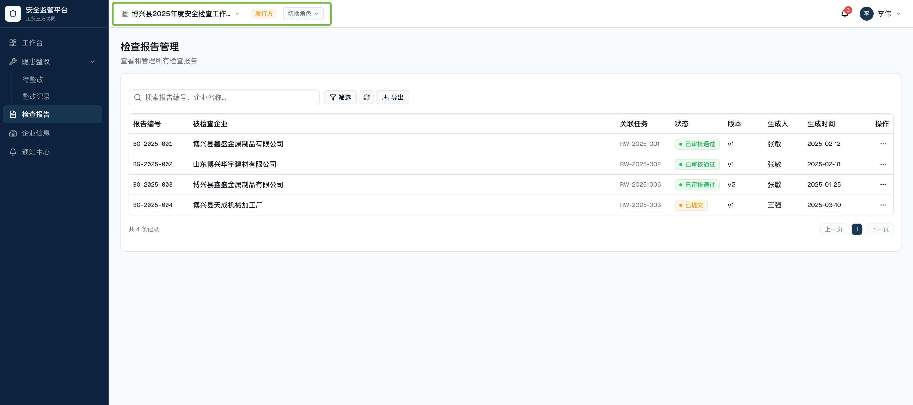
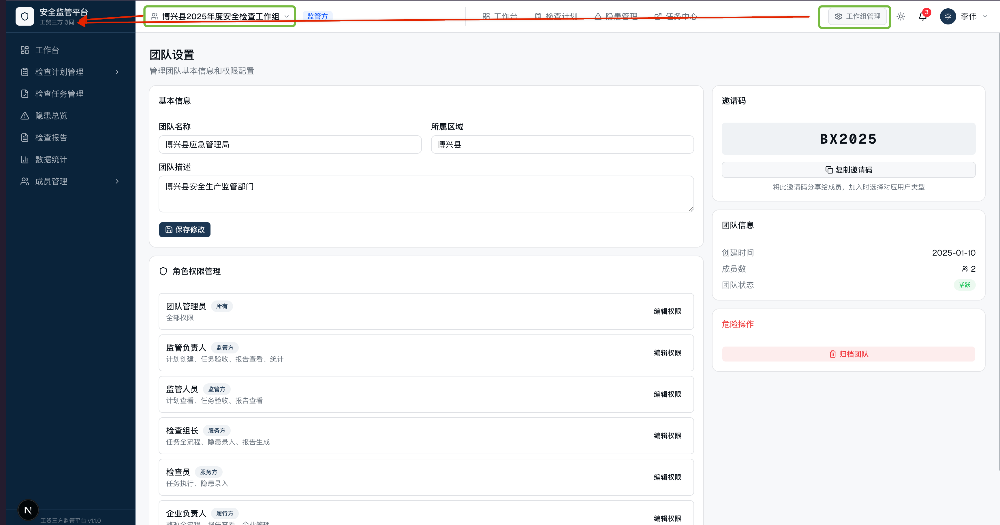
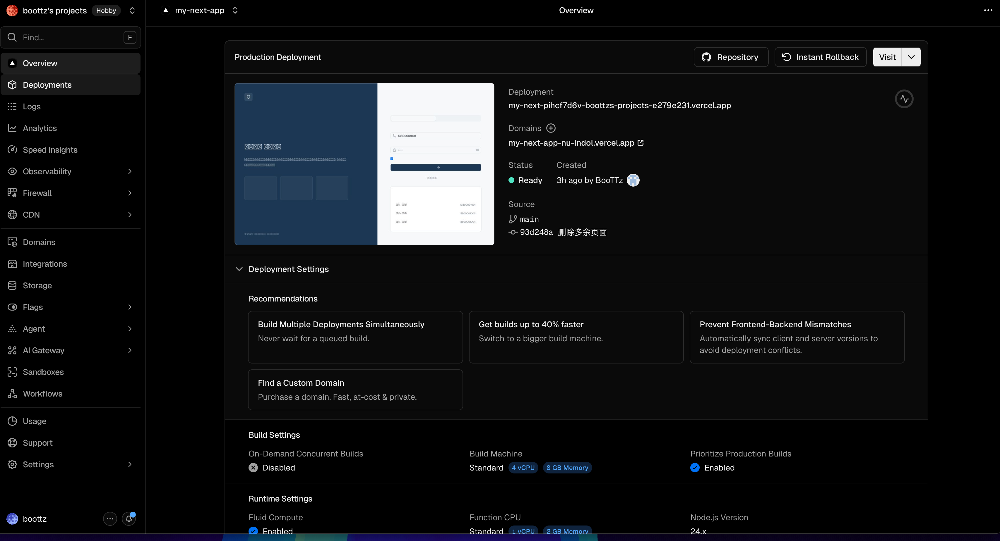

# 迭代 v1.0.2 设计说明

## 迭代说明

本次迭代内容基于《工贸三方监管平台-增强版设计》以及已有项目代码v1.0.1基础上进行的修改及增量设计，与前期版本设计内容冲突的内容以本版本为主。

## 迭代内容

### 1. 去掉检查计划及角色切换选项

去掉检查计划的下拉选择，如相应页面需要切换放到列表上部的筛选区

去掉角色切换按钮，因为单个账号在单个团队中只有一个角色，为了调试方便设置增加三个不同角色的演示账号

### 2. 团队与组织、成员管理整合为“工作组”

修改了团队的概念并增加了工作组的层级

团队是用户注册后创建或加入的用户对象类型组织（监管方、服务方、履行方）

团队的基本信息管理包括：团队类型（监管方、服务方、履行方）、团队人数、成员信息列表、加入或创建的工作组等

新注册用户只有在创建或加入一个团队后才能属于当前团队多在的工作组开展具体检查等业务功能，

一个用户可以加入多个团队，并切换进入某个工作组开展工作

工作组名称及管理按钮在左侧导航栏的顶部替换现有平台标题，同时把组织架构管理、成员管理、企业信息管理仅在工作组管理内体现。

#### 2.1 团队管理

团队管理支持变更团队类型或团队成员等基本信息

团队的角色管理目前仅包含：管理员、成员两个角色

不同的团队类型基本信息有一定区别

监管方：通常为政府安全管理部门，包含监管行业字段

服务方：通常为地方安全管理机构，包含机构资质、主要服务领域、机构人数

履行方：通常为企业，包含一些公司名称、行业类型（化工、工贸）、细分行业领域（行业小类）、规模等信息

团队在工作组外有一个团队管理的工作台及相关功能，包括当前团队类型所关联的检查、隐患或报告成员等相关数据

#### 2.2 工作组管理

将三个用户对象包含的企业信息、成员管理、组织管理、团队设置功能整合至导航栏顶部替代标题为实际工作组名称，并添加一个入口按钮进入工作组管理，具备管理权限的角色可以修改工作组信息，无编辑功能的用户可查看工作组信息。

新注册用户必须加入或创建团队才可以使用平台相应功能，邀请仅限团队与团队之间的邀请合并。

包含当前基本信息及工作组信息的查看卡片包含创建时间、成员数、团队状态、团队名称、所属区域、企业数量（履行方）、服务机构数量（服务方）等。

工作组的基本信息管理包含角色管理功能，包括管理员、成员

#### 2.3 工作组子页面

工作组包含四个标签页：组织信息、监管方、服务方、履行方

【组织信息】显示工作组包含的行政区划树，以及点击树节点右侧显示包含的团队列表

行政区划树及列表支持筛选团队类型的标签（监管方、服务方、履行方）

【监管方】显示类型为监管方的团队列表及基本信息，可进一步进入查看和管理其成员列表

【服务方】显示类型为服务方的团队列表及基本信息，可进一步进入查看和管理其成员列表

【履行方】显示类型为履行方的团队列表及基本信息，可进一步进入查看和管理其成员列表

#### 2.3 行政区划管理

工作组的左侧是一个行政区划树，根节点为当前工作组名称，可添加其下区划名称的子节点

工作组邀请团队加入后选择其所在的行政区划节点，如没有节点或默认为根节点

右侧列表显示团队的基本信息，可点击查看跳转到相应标签页的该团队详情信息内

## 补充说明

### 1. 关于用户与团队、工作的关系

用户与团队、工作组的关系都是一对多对多的关系，用户可以加入多个团队，同时进入该团队某个工作组内开展相关检查业务。

### 2. 业务的汇总与统计关系

#### 2.1 工作组内数据可见

某个检查组内所有检查任务等业务在工作组内可见，相当于监管方能看到某个服务方做了真对哪些履行方的检查，哪些履行方被哪项检查工作检查出了多少的隐患以及工作组内产生的检查报告各方可见。

#### 2.2 关于自身团队的跨工作组数据的可见

下一个迭代会考虑增加单个团队在不同工作组产生的针对自身团队相关业务数据的查看等功能。

### 3. 样式方面

#### 3.1 深色、亮色主题

增加深色\明亮可切换主题风格，以及在深与亮两种色调下相关组件的视觉可见一致性

#### 3.2 页面整体样式

更现代一些，参考github、vercel相似SaaS平台样式

