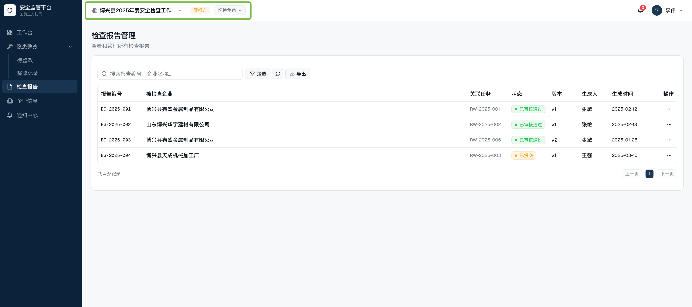

# 迭代 v1.1.0 设计说明

## 迭代说明

本次迭代内容基于《工贸三方监管平台-增强版设计》以及已有项目代码v1.0.1基础上进行的修改及增量设计，与前期版本设计内容冲突的内容以本版本为主。

## 迭代内容

### 1. 去掉检查计划及角色切换选项

去掉检查计划的下拉选择，如相应页面需要切换放到列表上部的筛选区

去掉角色切换按钮，因为单个账号在单个团队中只有一个角色，为了调试方便设置增加三个不同角色的演示账号



### 2. 团队与组织、成员管理整合为"工作组"

修改了团队的概念并增加了工作组的层级

团队是用户注册后创建或加入的用户对象类型组织（监管方、服务方、履行方）

团队的基本信息管理包括：团队类型（监管方、服务方、履行方）、团队人数、成员信息列表、加入或创建的工作组等

新注册用户只有在创建或加入一个团队后才能属于当前团队多在的工作组开展具体检查等业务功能，

一个用户可以加入多个团队，并切换进入某个工作组开展工作

#### 2.1 团队管理

团队管理支持变更团队类型或团队成员等基本信息

团队的角色管理目前仅包含：管理员、成员两个角色

不同的团队类型基本信息有一定区别

监管方：通常为政府安全管理部门，包含监管行业字段

服务方：通常为地方安全管理机构，包含机构资质、主要服务领域、机构人数

履行方：通常为企业，包含一些公司名称、行业类型（化工、工贸）、细分行业领域（行业小类）、规模等信息

团队在工作组外有一个团队管理的工作台及相关功能，包括当前团队类型所关联的检查、隐患或报告成员等相关数据

#### 2.2 工作组管理

将三个用户对象包含的企业信息、成员管理、组织管理、团队设置功能整合至导航栏顶部替代标题为实际工作组名称，并添加一个入口按钮进入工作组管理，具备管理权限的角色可以修改工作组信息，无编辑功能的用户可查看工作组信息。

新注册用户必须加入或创建团队才可以使用平台相应功能，邀请仅限团队与团队之间的邀请合并。

包含当前基本信息及工作组信息的查看卡片包含创建时间、成员数、团队状态、团队名称、所属区域、企业数量（履行方）、服务机构数量（服务方）等。

工作组的基本信息管理包含角色管理功能，包括管理员、成员

#### 2.3 工作组子页面

工作组包含四个标签页：组织信息、监管方、服务方、履行方

【组织信息】显示工作组包含的行政区划树，以及点击树节点右侧显示包含的团队列表

行政区划树及列表支持筛选团队类型的标签（监管方、服务方、履行方）

【监管方】显示类型为监管方的团队列表及基本信息，可进一步进入查看和管理其成员列表

【服务方】显示类型为服务方的团队列表及基本信息，可进一步进入查看和管理其成员列表

【履行方】显示类型为履行方的团队列表及基本信息，可进一步进入查看和管理其成员列表

#### 2.4 行政区划管理

工作组的左侧是一个行政区划树，根节点为当前工作组名称，可添加其下区划名称的子节点

工作组邀请团队加入后选择其所在的行政区划节点，如没有节点或默认为根节点

右侧列表显示团队的基本信息，可点击查看跳转到相应标签页的该团队详情信息内

### 3. 样式方面

#### 3.1 深色、亮色主题

增加深色\明亮可切换主题风格，以及在深与亮两种色调下相关组件的视觉可见一致性

#### 3.2 页面整体样式

更现代一些，参考github、vercel相似SaaS平台样式


---

## 补充说明

### 1. 关于用户与团队、工作的关系

用户与团队、工作组的关系都是一对多对多的关系，用户可以加入多个团队，同时进入该团队某个工作组内开展相关检查业务。

### 2. 业务的汇总与统计关系

#### 2.1 工作组内数据可见

某个检查组内所有检查任务等业务在工作组内可见，相当于监管方能看到某个服务方做了真对哪些履行方的检查，哪些履行方被哪项检查工作检查出了多少的隐患以及工作组内产生的检查报告各方可见。

#### 2.2 关于自身团队的跨工作组数据的可见

下一个迭代会考虑增加单个团队在不同工作组产生的针对自身团队相关业务数据的查看等功能。

---

---

# 迭代 v1.1.0 功能详细设计方案（优化版）

## 1. 功能概述

### 1.1 功能背景和目标

本次迭代基于《工贸三方监管平台-增强版设计方案》及 v1.0.1 版本进行，主要优化点包括：
- 简化界面交互，去掉冗余的选择器
- 重新定义团队架构，增加"工作组"层级
- 提升视觉体验，支持主题切换

### 1.2 核心用户角色

| 角色 | 参与功能 |
|------|---------|
| 所有用户 | 主题切换 |
| 监管方/服务方/履行方 | 工作组管理（查看权限根据角色不同） |

### 1.3 与其他模块的关联

| 本次改动 | 关联模块 |
|---------|---------|
| 工作组整合 | 用户管理、成员管理、组织架构、团队设置 |
| 去掉角色切换 | 登录流程、Dashboard |
| 主题切换 | 全局 UI 组件 |

---

## 2. 功能详细设计

### 2.1 功能列表

| 功能编号 | 功能名称 | 功能描述 | 优先级 |
|---------|---------|---------|--------|
| F2.1 | 工作组概念重构 | 引入工作组作为更高层级的组织单位 | P0 |
| F2.2 | 工作组信息卡片 | 顶部显示当前工作组基本信息 | P0 |
| F2.3 | 工作组管理入口 | 导航栏添加工作组管理入口 | P0 |
| F2.4 | 工作组子页面 | 组织信息、监管方、服务方、履行方四个标签页 | P0 |
| F2.5 | 行政区划树管理 | 左侧行政区划树的增删改查 | P0 |
| F2.6 | 去掉检查计划下拉选择 | 改用列表顶部筛选区 | P1 |
| F2.7 | 去掉角色切换按钮 | 改用演示账号切换 | P1 |
| F2.8 | 深色/亮色主题切换 | 全局主题样式切换 | P1 |
| F2.9 | 页面样式升级 | 参考 GitHub/Vercel 风格 | P2 |

### 2.2 功能流程图

#### 工作组创建流程

```
用户注册 → 创建/加入团队 → 选择工作组 → 分配行政区划 → 开始业务
```

#### 工作组邀请团队流程

```
工作组管理员 → 邀请团队 → 选择行政区划节点 → 团队接受 → 关联成功
```

### 2.3 权限说明

| 操作 | 管理员 | 成员 |
|-----|-------|------|
| 查看工作组信息 | ✓ | ✓ |
| 修改工作组信息 | ✓ | ✗ |
| 管理工作组成员 | ✓ | ✗ |
| 管理行政区划 | ✓ | ✗ |
| 邀请团队加入 | ✓ | ✗ |

---

## 3. 界面设计

### 3.1 页面结构

#### 3.1.1 全局顶部栏（修改后）

```
┌─────────────────────────────────────────────────────────────────┐
│ [Logo]  [工作组名称▼] [工作台] [检查计划] [隐患管理]...  [🔔] [👤] │
└─────────────────────────────────────────────────────────────────┘
```

**组件说明：**
- 工作组名称：点击展开下拉，可切换当前团队所在的工作组
- 工作组管理入口：仅管理员可见，点击进入工作组管理页面
- 主题切换：用户头像下拉菜单中添加深色/亮色切换选项

#### 3.1.2 工作组管理页面

```
┌─────────────────────────────────────────────────────────────────┐
│ [返回]                    工作组管理                    [编辑]   │
├─────────────────────────────────────────────────────────────────┤
│ ┌─────────────────┐ ┌─────────────────┐ ┌─────────────────┐       │
│ │ 工作组名称      │ │ 成员数量        │ │ 企业数量        │       │
│ │ XXX工作组       │ │ 12人           │ │ 5家             │       │
│ └─────────────────┘ └─────────────────┘ └─────────────────┘       │
│                                                                 │
│ [组织信息] [监管方] [服务方] [履行方]                            │
│ ─────────────────────────────────────────────────────────────── │
│                                                                 │
│ ┌───────────────────────┐    ┌─────────────────────────────┐   │
│ │ 行政区划树            │    │ 团队列表                    │   │
│ │ ▼ XXX工作组           │    │                             │   │
│ │   ├─ 博兴县           │    │ [团队卡片1]                 │   │
│ │   │  ├─ 店子镇        │    │ [团队卡片2]                 │   │
│ │   │  └─ 兴福镇        │    │ [团队卡片3]                 │   │
│ │   └─ 滨城区           │    │                             │   │
│ │                      │    │                             │   │
│ │ [+ 添加区划]         │    │                             │   │
│ └───────────────────────┘    └─────────────────────────────┘   │
│                                                                 │
└─────────────────────────────────────────────────────────────────┘
```

#### 3.1.3 工作组信息卡片

```
┌─────────────────────────────────────────────────────────────────┐
│ 工作组名称    │ 创建时间       │ 成员数 │ 团队状态 │ 企业数      │
│ XXX工作组    │ 2025-01-15     │ 12人   │ 活跃     │ 5家         │
└─────────────────────────────────────────────────────────────────┘
```

### 3.2 组件设计

#### 3.2.1 工作组选择器组件 (WorkspaceSelector)

```typescript
interface WorkspaceSelectorProps {
  currentWorkspace: Workspace;
  workspaces: Workspace[];
  onSwitch: (workspaceId: string) => void;
  showManageButton?: boolean; // 仅管理员显示
}
```

**状态：**
- Default：显示当前工作组名称
- Hover：展开下拉列表
- Loading：切换中状态

#### 3.2.2 行政区划树组件 (RegionTree)

```typescript
interface RegionTreeProps {
  regions: RegionNode[];
  selectedRegionId?: string;
  onSelect: (regionId: string) => void;
  onAdd?: (parentId: string, name: string) => void;
  onEdit?: (regionId: string, name: string) => void;
  onDelete?: (regionId: string) => void;
}
```

**交互：**
- 点击节点：选中并加载右侧团队列表
- 右键/长按：显示编辑/删除菜单
- 管理员：显示添加子节点按钮

#### 3.2.3 主题切换组件

**位置：** 用户头像下拉菜单

**样式选项：**
- 🌙 深色主题
- ☀️ 亮色主题（默认）
- 🌓 跟随系统

### 3.3 状态设计

| 页面状态 | 视觉表现 |
|---------|---------|
| 加载中 | 骨架屏 + 加载动画 |
| 空状态 | 空状态插图 + 引导文案 |
| 错误状态 | 错误提示 + 重试按钮 |
| 正常 | 数据列表/表单 |

---

## 4. 数据设计

### 4.1 数据模型

#### 4.1.1 工作组实体 (Workspace)

| 字段 | 类型 | 必填 | 说明 |
|------|------|------|------|
| id | string(UUID) | 是 | 工作组唯一标识 |
| name | string | 是 | 工作组名称 |
| region | string | 是 | 所属区域 |
| creatorId | string(FK) | 是 | 创建者用户ID |
| status | enum | 是 | 状态：active / archived |
| enterpriseCount | number | 否 | 履行方企业数量（自动计算） |
| serviceCount | number | 否 | 服务方机构数量（自动计算） |
| createdAt | datetime | 是 | 创建时间 |
| updatedAt | datetime | 是 | 更新时间 |

#### 4.1.2 行政区划节点 (RegionNode)

| 字段 | 类型 | 必填 | 说明 |
|------|------|------|------|
| id | string(UUID) | 是 | 节点唯一标识 |
| workspaceId | string(FK) | 是 | 所属工作组 |
| parentId | string(FK) | 否 | 父节点ID（根节点为null） |
| name | string | 是 | 区划名称 |
| sortOrder | number | 是 | 排序权重 |
| createdAt | datetime | 是 | 创建时间 |

#### 4.1.3 团队-工作组关联 (TeamWorkspace)

| 字段 | 类型 | 必填 | 说明 |
|------|------|------|------|
| id | string(UUID) | 是 | 关联ID |
| teamId | string(FK) | 是 | 团队ID |
| workspaceId | string(FK) | 是 | 工作组ID |
| regionId | string(FK) | 是 | 所在行政区划节点 |
| joinedAt | datetime | 是 | 加入时间 |

### 4.2 API 接口设计

| 接口 | 方法 | 说明 | 权限 |
|------|------|------|------|
| `/api/workspaces` | GET | 获取用户可访问的工作组列表 | 已登录 |
| `/api/workspaces/:id` | GET | 获取工作组详情 | 已登录 |
| `/api/workspaces/:id` | PUT | 更新工作组信息 | 管理员 |
| `/api/workspaces/:id/regions` | GET | 获取行政区划树 | 已登录 |
| `/api/workspaces/:id/regions` | POST | 添加行政区划节点 | 管理员 |
| `/api/workspaces/:id/regions/:regionId` | PUT | 更新行政区划节点 | 管理员 |
| `/api/workspaces/:id/regions/:regionId` | DELETE | 删除行政区划节点 | 管理员 |
| `/api/workspaces/:id/teams` | GET | 获取工作组内团队列表 | 已登录 |
| `/api/workspaces/:id/invite` | POST | 邀请团队加入 | 管理员 |

---

## 5. 交互设计

### 5.1 操作流程

#### 切换工作组

```
1. 点击顶部工作组名称
2. 展开下拉列表，显示所有可访问的工作组
3. 选择目标工作组
4. 页面刷新，加载新工作组数据
5. 顶部显示新工作组名称
```

#### 邀请团队加入工作组

```
1. 进入工作组管理页面
2. 点击「邀请团队」按钮
3. 弹出邀请弹窗
4. 选择团队类型（监管方/服务方/履行方）
5. 输入团队名称或邀请码
6. 选择所在行政区划节点
7. 确认邀请
8. 发送邀请通知给目标团队
```

### 5.2 表单验证

| 字段 | 验证规则 |
|------|---------|
| 工作组名称 | 必填，2-20字符 |
| 行政区划名称 | 必填，2-30字符 |

### 5.3 异常处理

| 场景 | 处理方式 |
|------|---------|
| 邀请团队不存在 | 提示"该团队不存在或邀请码无效" |
| 行政区划删除时有关联团队 | 提示"该区划下存在团队，无法删除" |
| 无权限操作 | 提示"您没有权限执行此操作" |

---

## 6. 技术实现建议

### 6.1 关键实现点

1. **主题系统**
   - 使用 CSS 变量定义主题色
   - `next-themes` 库实现主题切换
   - 持久化存储用户偏好（localStorage）

2. **行政区划树**
   - 使用递归组件渲染树形结构
   - 虚拟化列表优化大数据量渲染
   - 懒加载子节点数据

3. **工作组状态管理**
   - Zustand store 管理当前工作组上下文
   - 支持多工作组数据缓存

### 6.2 性能优化建议

- 行政区划树首次加载时请求完整数据，后续使用增量更新
- 团队列表使用分页加载
- 主题切换使用 CSS 变量切换，避免重新渲染组件

### 6.3 扩展性考虑

- 行政区划支持自定义层级深度
- 工作组支持自定义字段扩展
- 主题系统预留自定义主题配置

---

## 7. 与原设计的差异说明

| 原设计 | v1.1.0 变更 |
|-------|-----------|
| 团队直接关联用户 | 引入工作组层级，用户→团队→工作组 |
| 检查计划下拉选择 | 改为列表顶部筛选区 |
| 角色切换按钮 | 改为演示账号切换 |
| 单色主题 | 增加深色/亮色主题切换 |

---

## 8. 开发优先级建议

| 阶段 | 功能 | 预计工时 |
|------|------|---------|
| 第一阶段 | 工作组数据模型和基础 API | 1天 |
| 第二阶段 | 工作组选择器和信息展示 | 0.5天 |
| 第三阶段 | 工作组管理页面（含行政区划树） | 2天 |
| 第四阶段 | 主题切换功能 | 0.5天 |
| 第五阶段 | 界面样式优化 | 1天 |

---

## 9. 演示账号配置

为方便调试，提供三个不同角色的演示账号：

| 角色 | 账号 | 密码 | 说明 |
|------|------|------|------|
| 监管方 | demo_supervisor | demo123 | 监管方角色，可创建检查计划 |
| 服务方 | demo_inspector | demo123 | 服务方角色，可执行检查任务 |
| 履行方 | demo_enterprise | demo123 | 履行方角色，可进行隐患整改 |
